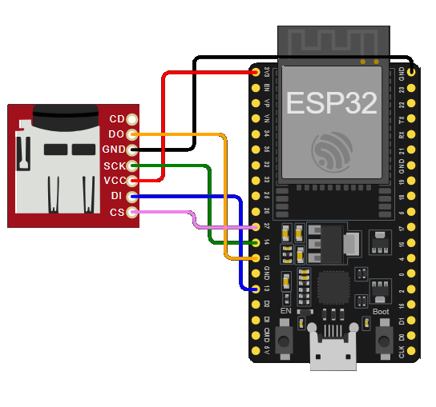

## Pinagem 


## Out

```
Cartão SD pronto!
Tipo do cartão SD: SDHC
Tamanho do cartão SD: 8MB
 _ _ _ _ INÍCIO DO PROGRAMA _ _ _ _ _
Listando diretórios: /
  ARQUIVO: sketch.ino  TAMANHO: 7704
  ARQUIVO: diagram.json  TAMANHO: 798
__
Criando diretório: /mydir
Diretório criado
__
Listando diretórios: /
  ARQUIVO: sketch.ino  TAMANHO: 7704
  ARQUIVO: diagram.json  TAMANHO: 798
  PASTA  : mydir
__
Removendo diretório: /mydir
Diretório removido
__
Listando diretórios: /
  ARQUIVO: sketch.ino  TAMANHO: 7704
  ARQUIVO: diagram.json  TAMANHO: 798
__
Escrevendo arquivo: /hello.csv
Arquivo escrito
__
Lendo arquivo: /hello.csv
Conteúdo do arquivo: Dado1
__
Mensagem adicionada
__
Lendo arquivo: /hello.csv
Conteúdo do arquivo: Dado1
Dado2,Dado3,Dado4
__
Deletando arquivo: /foo.csv
Falha ao deletar arquivo
__
Renomeando arquivo de /hello.csv para /foo.csv
Arquivo renomeado
__
Lendo arquivo: /foo.csv
Conteúdo do arquivo: Dado1
Dado2,Dado3,Dado4
__
Espaço total: 7MB
Espaço usado: 0MB
```
